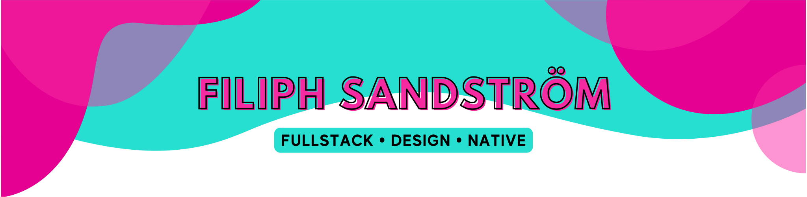

    
    
    
    

# 🤠 Hi, I'm Filiph Siitam Sandström

## 📖 Filiph Summarized

Howdy y'all! I'm Filiph Sandström[^1], a product engineer and (open source) software developer born 2000 in Sweden 🇸🇪. Currently on a mission to elevate and improve e-commerce through @NordcomInc, come join us!

My open source presence mainly consists of working on whatever I find interesting at that specific moment and have happened to grab my attention, so you can never really know what kind of projects the future holds for me.

[^1]: Sometimes (often previously) known under the alias `filfat`, mostly from way back in the day and mainly on homebrew forums like [gbatemp](https://gbatemp.net/members/filfat.318416/).

## 🗃️ Partial Summary of My Projects

Since starting out with software development as a very young kid[^2], I have pretty much managed to work on everything and anything from homebrew apps and games[^3], to a _(really bad)_[^4] HTML renderer [NXTBrowser](https://github.com/filiphsps/NXTBrowser), to the Minecraft Bedrock Edition server software [JSPrismarine](https://github.com/JSPrismarine/JSPrismarine) written entirely in TypeScript, to react components like [react-tender](https://github.com/sweet-side-of-sweden/react-tender) and utilities like [react-shopify-analytics](https://github.com/sweet-side-of-sweden/react-shopify-analytics), to just useful and simple [npm packages](https://www.npmjs.com/~filiphsandstrom), to a operating system [SerenityOS](https://github.com/SerenityOS/serenity/commits/master/?author=filiphsps), to a Windows Shell replacement with live-tiles [AdaptiveShell](https://github.com/filiphsps/AdaptiveShell).

[^2]: I started coding at 7 or 8 years old though I didn't really do anything before around the age of 10/11.
[^3]: e.g. [WiiCraft](https://github.com/filiphsps/WiiCraft) and [DownloadMii](https://github.com/filiphsps/DownloadMii-3DS), projects I used to work on in my free time as a young-ish teenager.
[^4]: Citation Needed, [xkcd 285](https://xkcd.com/285/).

## 👀 Upcoming and Planned Projects

These are just ideas at the moment, which may or may not get worked on in the future.

- **Live-Tiles**. If that is continuing the jetpack compose android launcher I contributed a bit to. Or if it's AdaptiveShell or even if it's something completely different; I don't know yet, I just want to do something with Live-Tiles.
- **SerenityOS**. Any of these are possible that I work on. Maybe, maybe not?
  - Improve `StylePainter`, to add a modern flat one as an option.
  - Vertical `Taskbar`, not something I personally use, but might be fun to build.
  - Real `Services`, a service management system similar to what was proposed in [#6315](https://github.com/SerenityOS/serenity/pull/6315).
  - Complete `Devices`, devicemanager-ish but 98 style that I prototyped nov 22 [picture](https://cdn.discordapp.com/attachments/830522505605283866/1047590886395093104/image.png) & [branch](https://github.com/SerenityOS/serenity/compare/master...filiphsps:serenity:dev-devmgmt).
- **WiiCraft**. About time we gave it justice after all these years with a half-decent `DSCraft`-scope version. Unlikely any time soon though as I don't really feel any motivation for such a project.

## 🤩 Support My Work

If you like any of my open source work and enable me to spend even more time on it (thank you) you can support me either by buying [Swedish candy from Sweet Side of Sweden](https://www.sweetsideofsweden.com/?utm_source=GitHub&utm_campaign=opensource&utm_content=filiphsps/README.md) (a side-business I run with a few friends) or through [GitHub Sponsors](https://github.com/sponsors/filiphsps). Either way it's very much appreciated and **incredibly helpful** 💛💛

## ☎️ Get in Contact With Me

The best way to get in contact with me is either through _filiph.sandstrom[at]filfatstudios.com_ or for non-business related inquires better yet on [Twitter](https://twitter.com/filiphsandstrom). Feel free to contact me for pretty much any reason like, freelancing work, to discuss a project, or literally whatever else you might have get in contact with me for!

